# Sistemas de Computación
## Trabajo Practico # 1: Rendimiento

Integrantes:

* María Clara Gonzalez Leahy
* Anna Nuñez
* Ignacio J. Vigezzi  

**Profesores:** Miguel Ángel Solinas y Javier Alejandro Jorge

**Universidad Nacional de Córdoba**  
**Facultad de Ciencias Exactas, Físicas y Naturales**

## Objetivo
Se debe diseñar e implementar una interfaz que muestre el índice GINI. La capa superior recuperará la información del banco mundial 
mediante el uso de API Rest y Python. Los datos de consulta realizados deben ser entregados a un programa en C (capa intermedia) que convocará rutinas en ensamblador para que hagan los cálculos de conversión de float a enteros y devuelva el índice de un país como Argentina u otro sumando uno (+1). Luego el programa en C o python mostrará los datos obtenidos.

## Primera iteración

**Capa superior:** Se utilizo Python para consultar la API Rest del banco central para obtener el índice GINI de cada año entre 2011 y 2020 del pais selecciónado como entrada con el codigo ISO correspondiente.

**Capa intermedia:** Mediante el modulo ctypes se cargó la función de conversión y suma programada en C y compilada como libreria compartida. Esta toma un argumento de punto flotante, lo convierte a un entero y le suma 1. El programa principal imprime la lista original con los valores junto al año que corresponden, realiza la conversión, y finalmente vuelve a imprimir los valores ajustados.

## Segunda iteración

Al funcionamiento de la iteración anterior se le agrega el uso de funciones programadas en lenguaje ensamblador para la conversión de dos valores de punto flotante a enteros y sumarlos. Estas se exportan como una función externa en un programa en C que se encarga de empaquetarlas para poder ser utilizadas en Python.

Para la conversión de los valores de punto flotante se utilizo la instrucción **cvttss2si**. Esta toma el argumento de tipo float, guardado en los registros %xmmX como se define en las convenciones de llamada System V AMD64 ABI, los convierte a valores enteros de doble palabra y los guarda en los registros %rsi y $rdi. Posteriormente se llama a la función suma, que toma el valor de %rdi y lo guarda en %rax, se ejecuta la instrucción addq que suma el valor de %rsi a %rax, donde se guarda el resultado final de la operación y es el registro utilizado para devolver el valor de la función segun la convencion de llamada.

### Debugging

Utilizando GDB se puede ver el comportamiento de los registros durante la ejecución del programa.

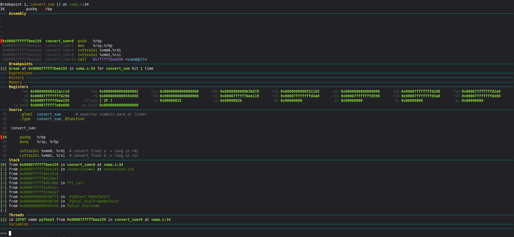
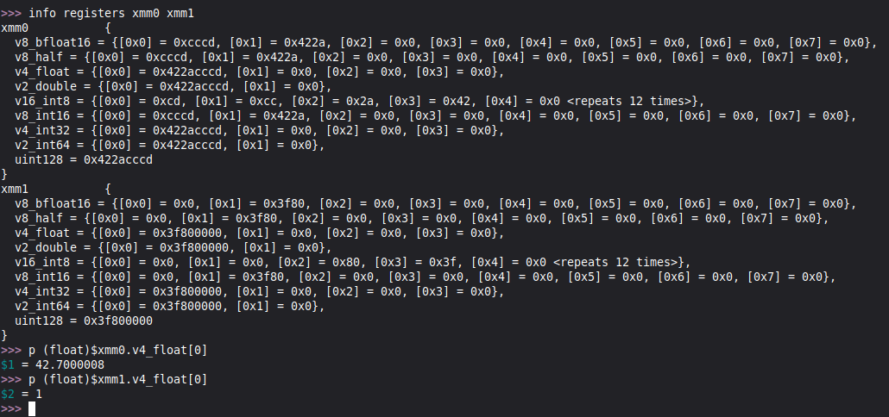

* Si se marca un break point al inicio de la función se puede analizar la situacion inicial de los registros y el stack. Se pueden ver los argumentos de la llamada guardados en %xmm0 y %xmm1

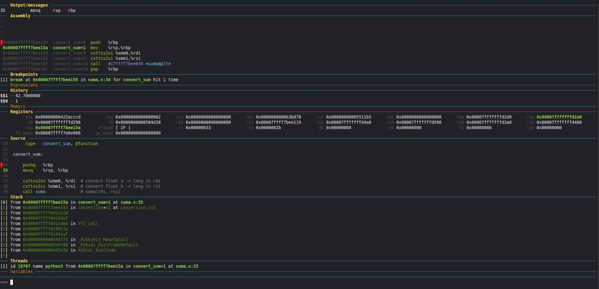
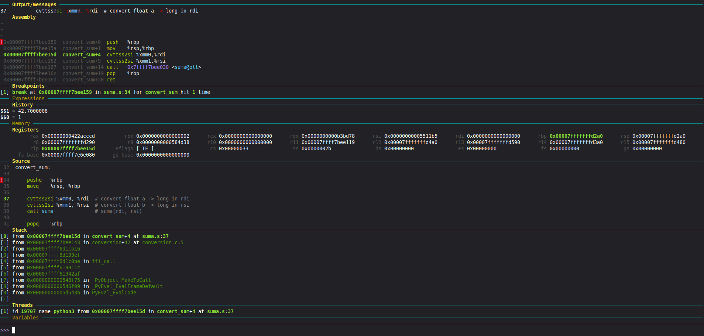

* Al ejecutarse pushq y movq se puede ver como el valor de rsp disminuye en 8 bytes, guardando el valor de rbp del main en la pila y creando el nuevo *Stack Frame* para la función.

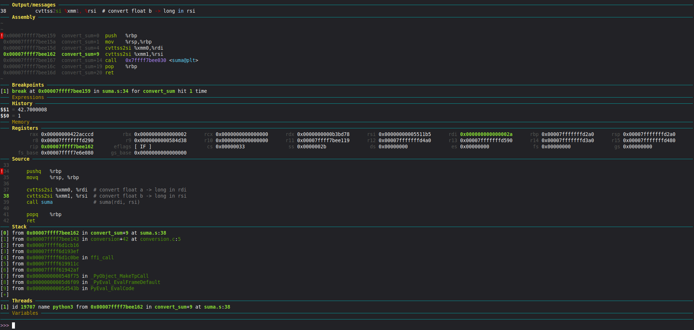

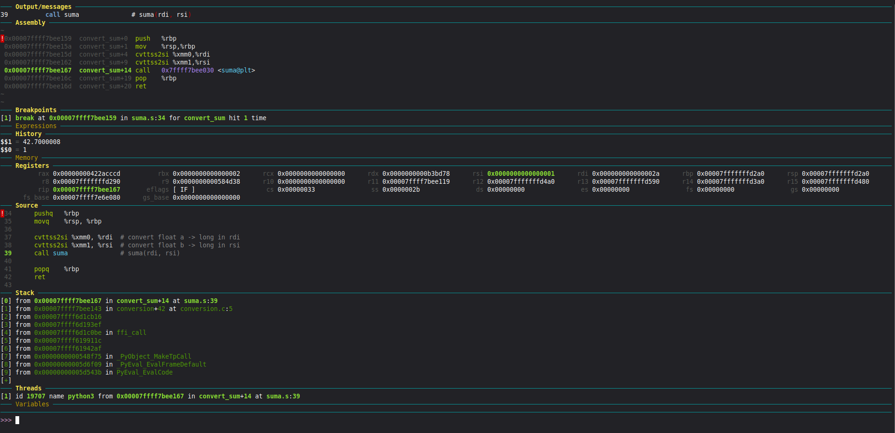

* Al ejecutarse cvttss2si se puede ver como se cargan los valores float ya convertidos a enteros. 0x01 en rsi y 0x02a que en decimal equivale a 42.

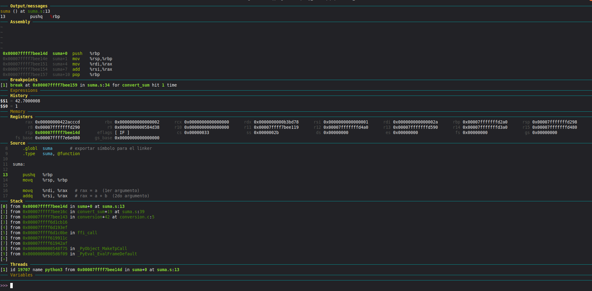
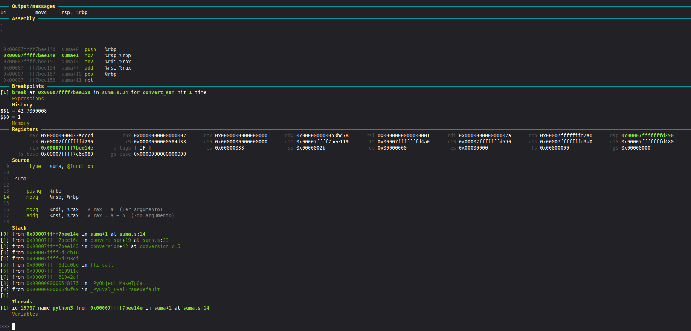

* Cuando se llama a suma se vuelve a guardar rbp y crear el stack de suma.

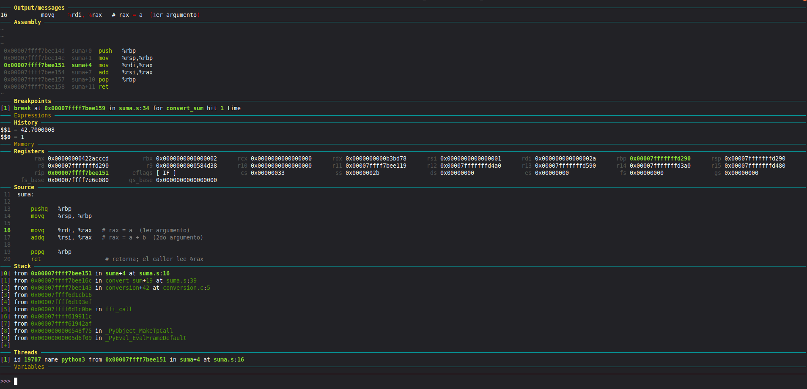
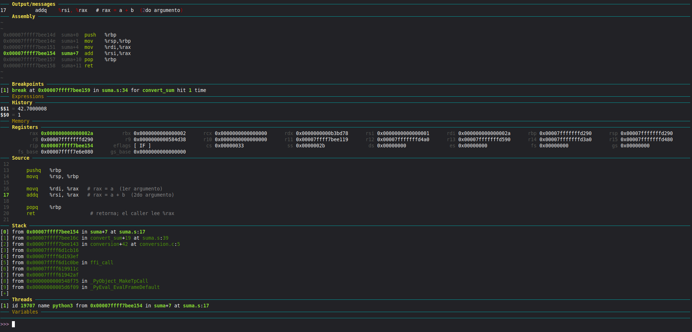

* Para sumar se carga el primer valor en %rax, se ejecuta add con el segundo valor y el resultado queda guardado en %rax por convención de llamadas.

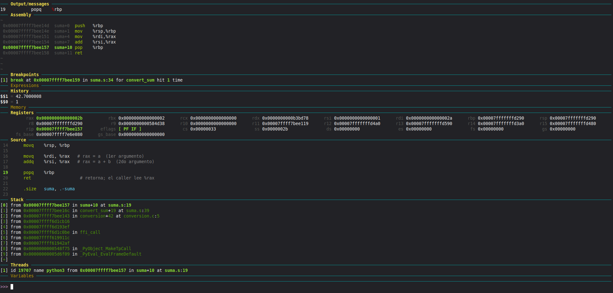
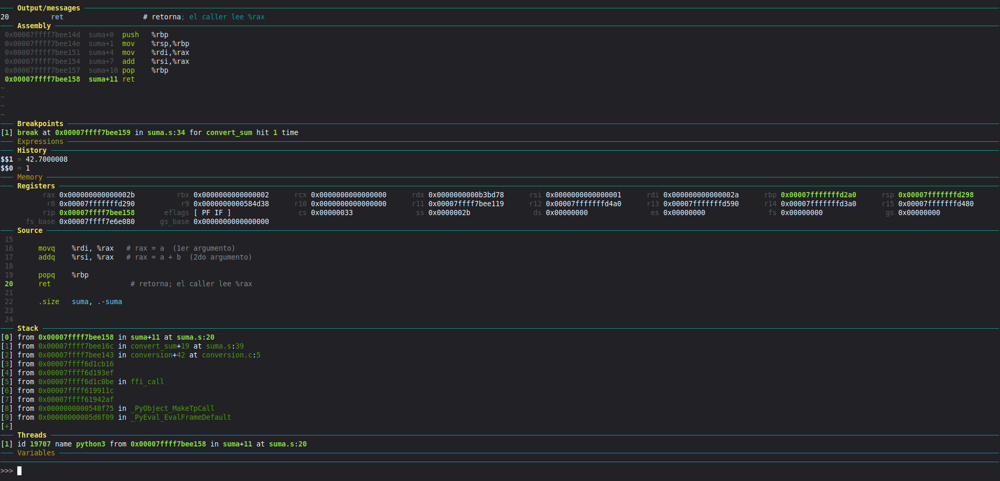

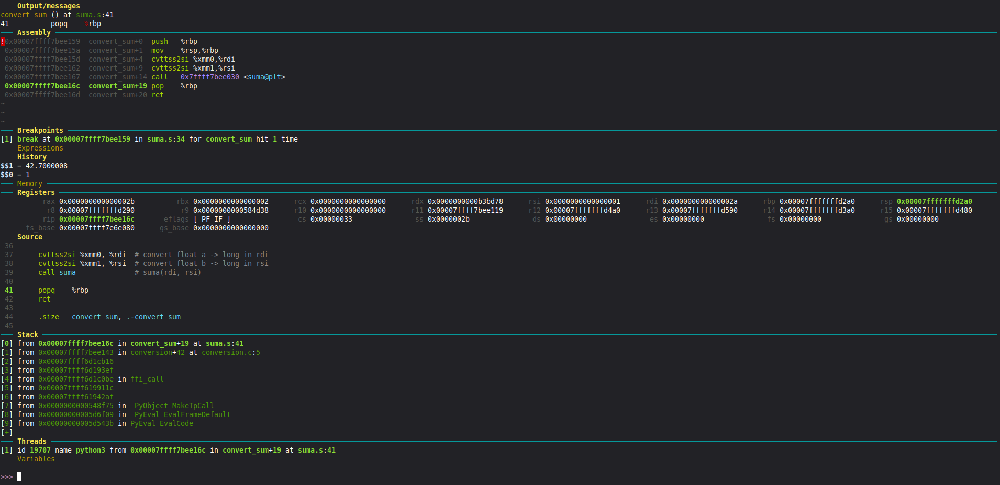
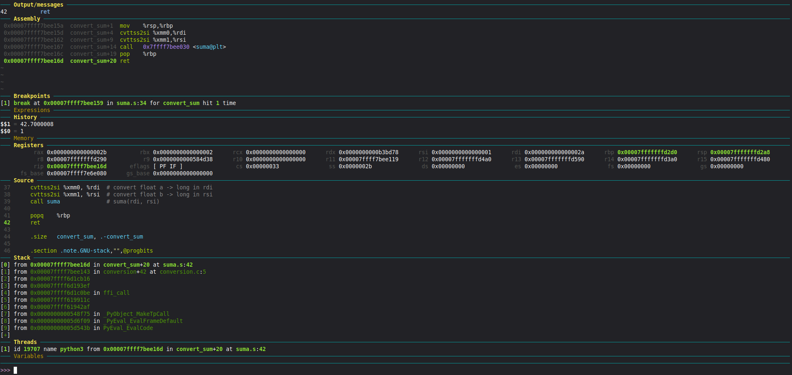

* Se ejecutan los pop y ret para recuperar los valores de rbp y retornar de las funciones al main.

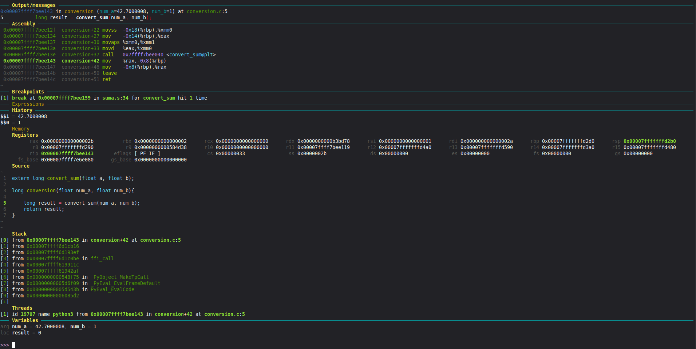
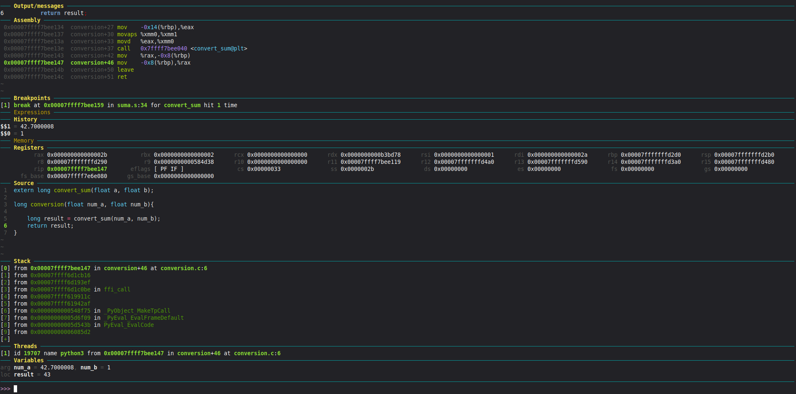

* Finalmente la función retorna el valor convertido y sumado.